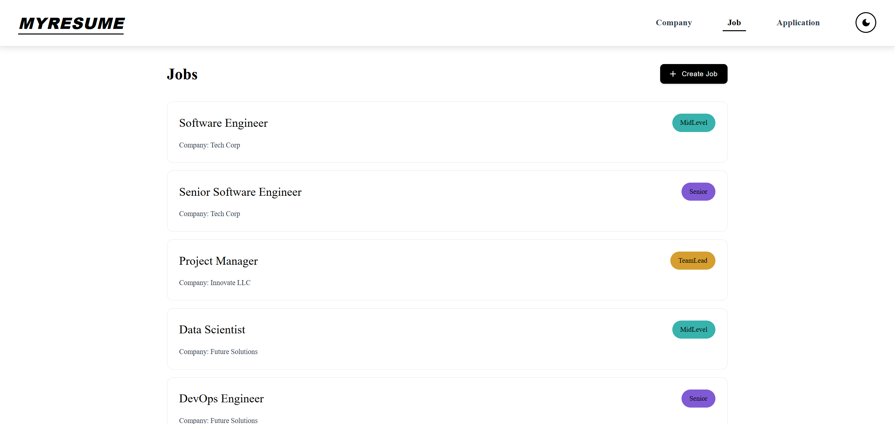
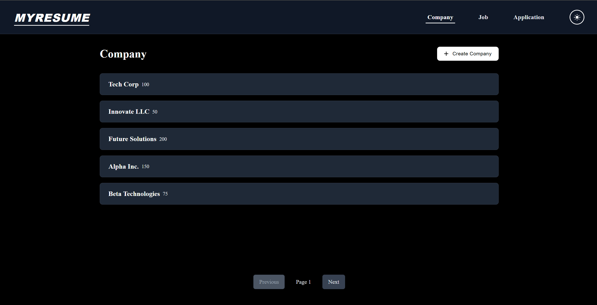
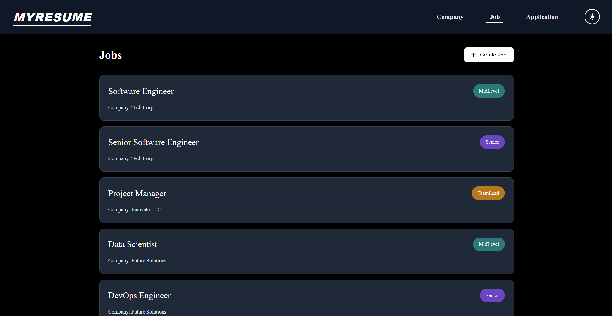
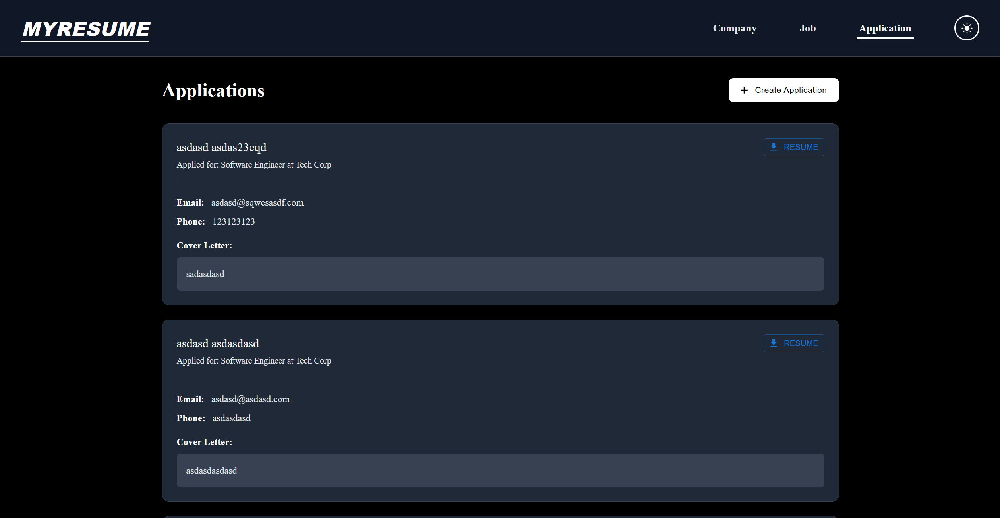
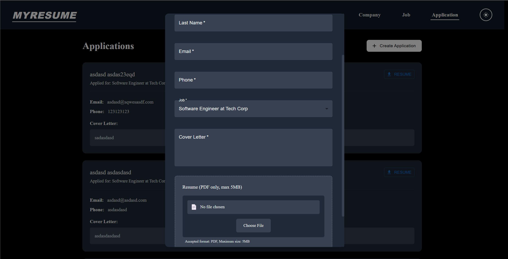
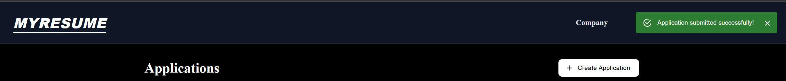

# Resume Management Web Application

> This is a hobby project developed with the idea of keeping track of all the job applications I've submitted to different companies. The next phase of development will include deployment and user authentication to enable multiple users to manage their own application data separately.

A modern, full-stack web application for managing job applications and resumes. Built with React, .NET Core, and SQL Server, featuring a beautiful dark/light theme and modern UI components.

## Screenshots

### Main Dashboard (Light Mode)


_Main dashboard interface showcasing the clean, modern design with Material-UI components in light mode_

### Company Management


_Company management interface displaying the list of companies with size indicators and interactive cards_

### Job Management


_Job listings page showing different positions with color-coded job levels and company associations_

### Application Tracking


_Application tracking interface where users can view and manage their submitted applications_

### Application Submission


_Interactive modal for submitting new job applications with resume upload and form validation_

### Notification System


_Toast notification system providing user feedback for actions and system status_

## Features

### 1. Modern UI with Dark/Light Theme

- Fully responsive design with Material-UI components
- Seamless dark/light theme switching
- Theme preference persistence across sessions
- Custom color palette for both themes
- Smooth transitions between theme changes

### 2. Company Management

- View list of companies with size indicators
- Create new companies with size classification
- Interactive company cards with hover effects
- Pagination for large datasets
- View company-specific job listings

### 3. Job Management

- Create and manage job postings
- Color-coded job levels (Intern, Junior, Mid-Level, Senior, Team Lead, CTO, Architect)
- Associate jobs with companies
- View all applications for specific jobs
- Intuitive job cards with hover effects

### 4. Application Management

- Submit job applications with resume upload
- PDF resume support with size validation (max 5MB)
- Cover letter submission
- Download submitted resumes
- View all applications with detailed information
- Form validation with user-friendly feedback

### 5. Technical Features

- Dockerized development and production environments
- SQL Server database with Entity Framework Core
- AutoMapper for DTO mappings
- Swagger API documentation
- CORS configuration for security
- File upload handling with validation
- Responsive error handling and notifications

## Technology Stack

### Frontend

- React with TypeScript
- Material-UI components
- SCSS modules for styling
- Context API for state management
- Axios for API communication

### Backend

- .NET Core 8.0
- Entity Framework Core
- SQL Server
- AutoMapper
- Swagger/OpenAPI

### Infrastructure

- Docker
- Docker Compose
- Nginx (for production)

## Running the Application

### Prerequisites

- Docker
- Docker Compose

### Quick Start

1. Clone the repository:

```bash
git clone <repository-url>
cd rResumeMgtWebAPIDotNet
```

2. Start the application using Docker Compose:

```bash
docker-compose up -d
```

This will start:

- SQL Server on port 1433
- Backend API on port 8080
- Frontend on port 3000

3. Access the application:

- Frontend: http://localhost:3000
- Backend API/Swagger: http://localhost:8080/swagger

### Development Setup

The project includes development configurations with hot-reload:

```bash
# Start development environment
docker-compose up -d

# View logs
docker-compose logs -f

# Stop all services
docker-compose down
```

## Architecture

### Database Schema

- Companies: Stores company information and size
- Jobs: Manages job postings with levels and company associations
- Applications: Handles candidate applications with resume storage

### API Endpoints

- `/api/Company`: Company management
- `/api/Job`: Job posting management
- `/api/Candidate`: Application and resume management

### File Storage

- Resumes are stored in a dedicated uploads directory
- File validation ensures PDF format and size limits
- Secure file download implementation

## Best Practices Implemented

1. **Frontend**

- Component-based architecture
- Custom hooks for shared logic
- Theme context for global state
- Consistent error handling
- Form validation
- Responsive design
- Accessibility considerations

2. **Backend**

- Repository pattern
- DTO pattern
- Dependency injection
- Async/await operations
- Proper error handling
- API documentation
- File validation

3. **Security**

- CORS configuration
- File type validation
- Size limitations
- Error message sanitization

4. **Performance**

- Lazy loading
- Pagination
- Optimized database queries
- Efficient file handling

## Future Plans

1. **Deployment**

   - Set up CI/CD pipeline
   - Configure production environment
   - Implement monitoring and logging

2. **Authentication & Authorization**

   - User registration and login
   - JWT authentication
   - Role-based access control
   - Data isolation between users

3. **Additional Features**
   - Application status tracking
   - Email notifications
   - Interview scheduling
   - Analytics dashboard

## Contributing

1. Fork the repository
2. Create your feature branch
3. Commit your changes
4. Push to the branch
5. Create a new Pull Request

## License

This is a personal project created for learning purposes and portfolio demonstration. Feel free to:

- View and fork the code
- Suggest improvements
- Use it as inspiration for your own projects
